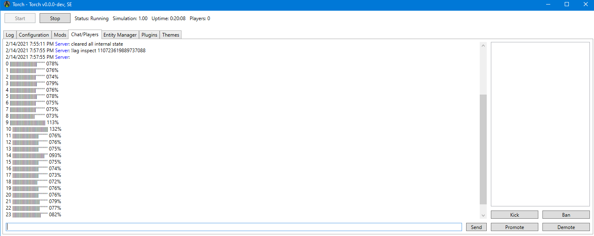

# TorchAutoModerator

Auto Moderator is a Torch plugin to let players moderate the server lag themselves.

This plugin will,

1. send out visible warnings to server-necking players;
2. provide a means for them to know their impact on the server and how to fix it;
3. if they ignored the warning, punish their ass (in a variety of ways).

This plugin is primarily designed to address the issue that some server admins are
constantly checking the server status (via [TorchMonitor](https://github.com/HnZGaming/TorchMonitor))
and reaching out every single laggy player in game.
This plugin should automate the whole process and further take necessary actions 
to keep the server healthy without the admin presence. 

Note that this plugin will only work on `MySector` part of the game.
`MyPhysics` and anything else cannot be traced up to specific grids/players;
you will need to active BlockLimiter and/or other plugins to remove/limit certain blocks
that tend to add up elsewhere.

## General

This plugin's main loop follows this cycle:
1. Profile top 50 grids and players in game (using Profiler plugin);
2. Keep track of them in a simple time series database in RAM;
3. Pin any grids and players that exceed their punishment threshold for a long enough time;
4. Punish all players in possession of those pinned grids (or pinned players themselves);
5. Keep it as a warning if given grid or player exceeds their warning threshold but below punishment.

The TSDB will hold onto profiled entities' computation time (ms/f) for a set length of time and
it's used by warnings and punishments to take action (in combination with their set thresholds to figure out the border).
You can run `!lag inspect <entity_id>` to inspect each entity's current tracking state if you ever needed to
(or simply `!lag inspect` to see all entities):

Pins (=source of punishment) will stay for a set length of time in the system regardless its entity's current state in TSDB.
A pin will count down for a set length of time and release itself.
Though if the corresponding entity continues to stay above the punishment threshold the pin will never release and the punishment will never stop.

You can filter out factions from the punishment by registering their faction tags in the config.
Convenient for public/admin assets such as a trading post or community hub.

## Grids and Players

You can set a different threshold (ms/f) for grids and players as they're managed in separate TSDB instances. 
This enables to combat the case where the server houses a sheer number of grids owned by a small number of players of all others.

To disable one measurement or another, crank it up to like 1000000 so that nobody can reach the threshold.

## Lag Warning

Players will receive a warning when they're considered lagging the server.
The warning takes the form of Questlog and notification in players' HUD.

You can configure when the warning should kick in for players based on their impact on the server health.
You can generally control the length of this "grace period" by the combination of the warning threshold and the tracking time length,
that said, it varies depending on given entity's ms/f over the tracked period.

## Profiler Command
Players can type a command in game chat as `!lag profile` to show the laggiest grids and block types
so that they can quickly figure out which grids and blocks need a fixing.
`!lag profile -this` will exclusively profile a grid that the player is sitting on or looking at.
You should make sure to give players this instruction in the warning text.

## Punishments

Following is the list of punishments:

### Chat

Sends out the names of laggy players to the whole server.
This punishment can be invoked along with other types of punishment.
This is useful for admins to back-track all punishments that have taken place via SEDB plugin.
You can configure to enable/disable this feature, message sender name and text format.

### Shutdown

Completely shuts down laggy grids, rendering it unusable.
Players cannot reactivate the grid until the punishment is over.

### Damage

Applies progressive damage to laggy grids.
You can configure the damage per interval and the minimum integrity.

### Broadcast

Sends out GPS coordinates of laggy grids to the whole server until the punishment is over.
Players can see these GPSs (unless configured as admin-only).

## Configs & Debugs

You can list up most of available config properties via `!lag configs`:

See most of current config property values by `!lag configs all`.

To set a new value to a config property, 
* `!lag configs <property_index> <new_value>`
* `!lag configs <property_name> <new_value>`

as in `!lag configs 0 120` or `!lag configs FirstIdleTime 120`.

To list up all available commands, `!lag commands`.

To view DEBUG or TRACE logs navigate to `Logging` section of the config and tick on appropriate checkboxes.
Note TRACE will freeze the console if your server has 100+ grids.
Tick on `Suppress Console Output` and read the log file for safety.

## Instructions

You should start with zero punishment first and watch the DEBUG log to work out the numbers.
TorchMonitor would serve a long-term set of samples to figure out good numbers to use.

* `FirstIdleSeconds` -- should be larger than 120 to be sure.
* `TrackingTime` -- should generally be larger than you think. 5 minutes (300) to 10 minutes (600) is a good start.
* `PunishTime` -- should be about 10 minutes (600) in general. In case of Broadcast punishment, set to like half an hour for other players to go after the grid.
* `WarningLagNormal` -- generally `0.7` - `0.8` is a good start.

## Dependencies

* [Profiler plugin](https://torchapi.net/plugins/item/da82de0f-9d2f-4571-af1c-88c7921bc063).

## Fork & Extend

Feel free to fork and develop your own logic on top of this plugin under MIT license.