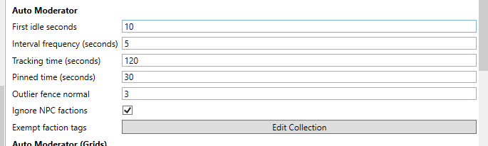
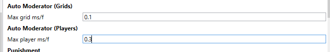
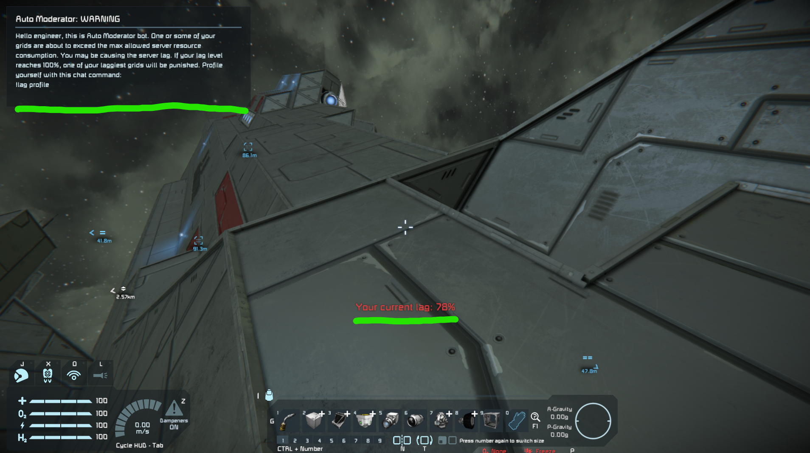
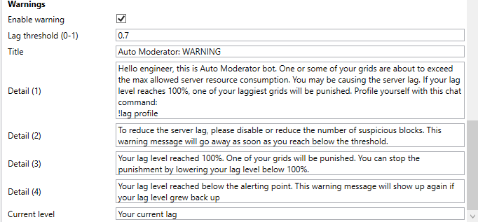
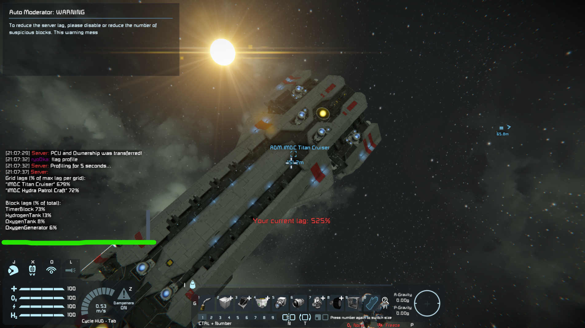
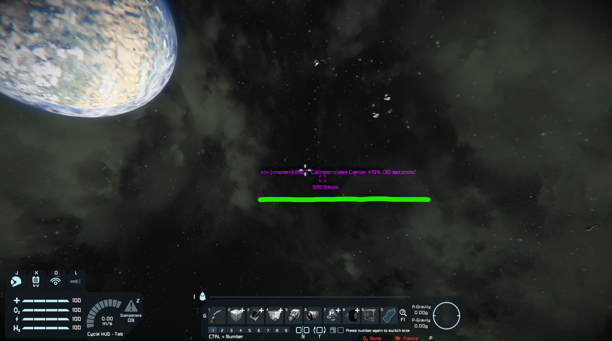
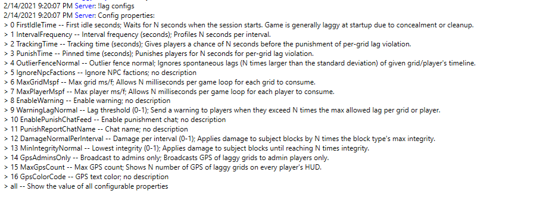
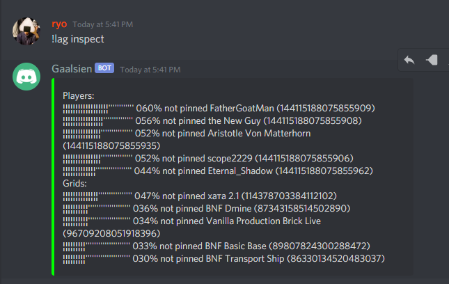
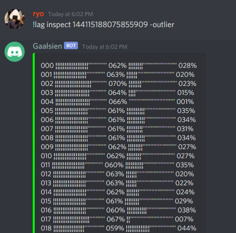
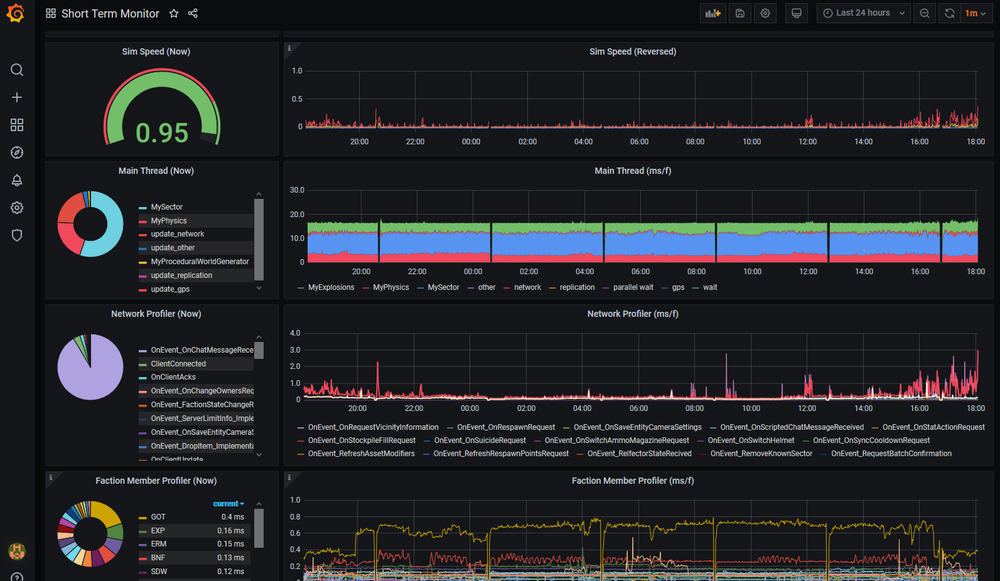

# TorchAutoModerator

Auto Moderator is a Torch plugin to let players moderate the server lag themselves.

This plugin will,

1. send out visible warnings to server-necking players;
2. let them profile themselves and let them know how to fix it;
3. if they ignored the warning, punish their ass (in a variety of ways).

This plugin is primarily designed to address the issue that some server admins 
using [TorchMonitor](https://github.com/HnZGaming/TorchMonitor) are constantly checking the server status
and reaching out every single laggy player in game.
This plugin should automate the whole process and further take necessary actions 
to keep the server healthy without the admin presence.

Note that this plugin will only work on `MySector` for now.
You need other means to moderate `MyPhysics` and anything else that can't be traced up to specific grids/players.

[Download the latest version from Torch Plugin Repository.](https://torchapi.net/plugins/item/8333d8a5-c545-42d9-a606-8dae9db3c678)

## General

This plugin's main loop follows this cycle:
1. Profile top 50 grids and players in game (using Profiler plugin);
1. Keep track of them in a time series;
1. Pin grids/players that exceed their punishment threshold for a long enough time;
1. Send out warnings to nearly-pinned players;
1. Punish pinned players and players in possession of pinned grids.

The time series holds onto the series of computation time (ms/f) of all profiled grids/players for a set length of time.
The system will look up this time series to perform warnings and punishments (according to their respective thresholds).
You can run `!lag inspect <entity_id>` to inspect each player or grid's time series or `!lag inspect` to see all entities.

Pins (=source of punishment) will stay in the system for a set length of time and release itself,
though if the corresponding entity's ms/f continues to stay above the punishment threshold 
the pin will never release (and the punishment will never stop).

You can filter out factions from the punishment by registering their faction tags in the config.
Convenient for public/admin assets such as a trading post or community hub.

## Grids and Players

You can set a different threshold (ms/f) for grids and players as they're managed in separate TSDB instances. 
This enables to combat the case where the server houses a sheer number of grids owned by a small number of players of all others.

To disable one measurement or another, crank it up to like 1000000 so that nobody can reach the threshold.

## Lag Warning

Players will receive a warning when they're considered lagging the server.
The warning takes the form of Questlog and notification in players' HUD.

You can configure when the warning should kick in for players based on their impact on the server health.
You can generally control the length of this "grace period" by the combination of the warning threshold and the tracking time length.

## Player's Profiler Command
Players can type `!lag profile` to profile their grids so that they can figure out which grids (and blocks) need a fixing themselves.
`!lag profile -this` will profile the grid that the player is sitting on or looking at.
You should make sure to give players this instruction in the warning text.

## Punishments

Following is the list of punishments that you can choose from:

### Chat

Sends out names of laggy players to the whole server.
This punishment can be invoked along with other types of punishment.
This is useful for admins to back-track all punishments that have taken place via SEDB plugin.
You can enable/disable this feature, change sender name and text format.

### None

No punishment (unless the chat message is active).

### Shutdown

Completely shuts down laggy grids.
Players cannot reactivate the grid until the punishment is over.
This is the least destructive punishment and easily reversible for players.
Some types of blocks will stay active to make sure that 
they won't be deleted by whatever cleanup system running in the server.

### Damage

Applies progressive damage to laggy grids.
You can configure the damage per interval and the minimum integrity.
This punishment can leave severe damage to subject grids and 
is not recommended until you configure the system thoroughly.

### Broadcast

Sends out GPS coordinates of laggy grids to the whole server until the punishment is over.
These GPSs are visible to a set of players according to the plugin configuration.
Players can mute these GPSs by `!logs gpsmute`.

## Instruction for Admins

### Configs

You can list up most of available config properties via `!lag configs`:

See most of current config property values by `!lag configs all`.

To set a new value to a config property, 
* `!lag configs <property_index> <new_value>`
* `!lag configs <property_name> <new_value>`

as in `!lag configs 0 120` or `!lag configs FirstIdleTime 120`.

### Commands

To list up all available commands, `!lag commands`.

### Logging & Debugging

To view DEBUG or TRACE logs navigate to `Logging` section of the config and tick on appropriate checkboxes.
Note TRACE will freeze the console if your server has 100+ grids.
Tick on `Suppress Console Output` and read the log file.

### Initial Configuration

Start with zero punishment first and watch the DEBUG log to figure out the numbers.
[TorchMonitor](https://github.com/HnZGaming/TorchMonitor) would help you find a long-term set of samples.

* `FirstIdleSeconds` -- should be larger than 120 to be sure.
* `TrackingTime` -- should generally be larger than you think. 5 minutes (300) to 10 minutes (600) is a good start.
* `PunishTime` -- should be about 10 minutes (600) in general, or half an hour (1800) for Broadcast punishment.
* `WarningLagNormal` -- generally `0.7` - `0.8` is a good start.

Punishment type should be None to start with, and run it for at least a week.
If you intend to use Broadcast punishment you should start with "visible to admin only" configuration.

### Working with Other Plugins

Consider deleting "unowned" grids using some other plugin so that the warning and punishment get through everyone responsible.

Use [SEDB](https://torchapi.net/plugins/item/3cd3ba7f-c47c-4efe-8cf1-bd3f618f5b9c) plugin to 
monitor the current state of the server:

For more comprehensive/long-term monitoring consider [TorchMonitor](https://github.com/HnZGaming/TorchMonitor):

## Instruction for Players

* `!lag profile` to profile your stuff; anything above `100%` is subject to punishment.
* `!lag inspect` and `!lag inspect <entity_id>` to see the details.
* `!lag configs` and `!lag configs all` to see all accessible server configs, including the punishment type.
* `!lag commands` to see all accessible chat commands.

## Dependencies

* [Profiler plugin](https://torchapi.net/plugins/item/da82de0f-9d2f-4571-af1c-88c7921bc063).

## Fork & Extend

Feel free to fork and develop your own logic on top of this plugin under MIT license.

## Bugfix & Feature Requests

Submit an issue in GitHub or start a discussion in [TorchMonitor Discord](https://discord.gg/AaqdbWa3AP).